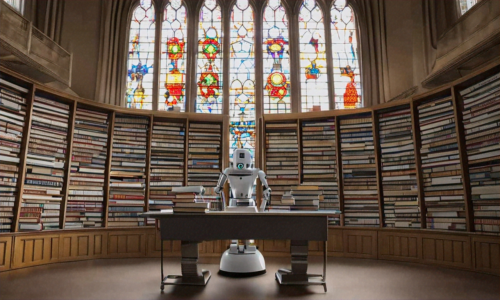

# smart_merge project 

This is a work in progress tool to solve some issues when collecting many, many old backups I had over the years.
I hate losing memories (being these pictures, old writings, pieces of code, excel sheets with projects I imagined, notes from friemds, etc) so I kept a vast collection of unusable backups.
After many years of trying to sort this out I decided to give it a try and focus on making something that may actually work. Time will tell :)

